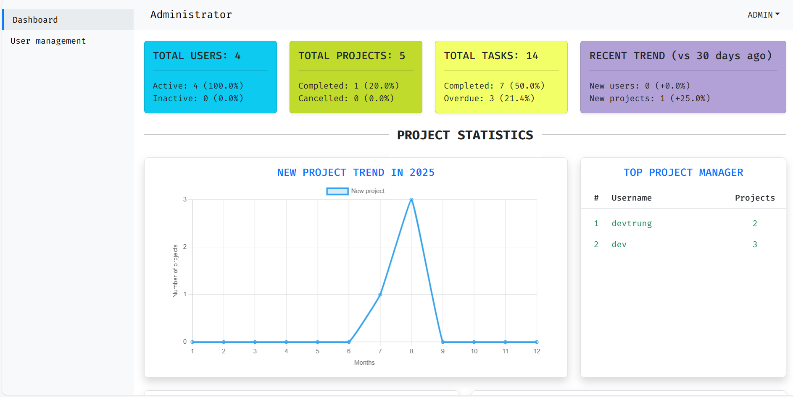
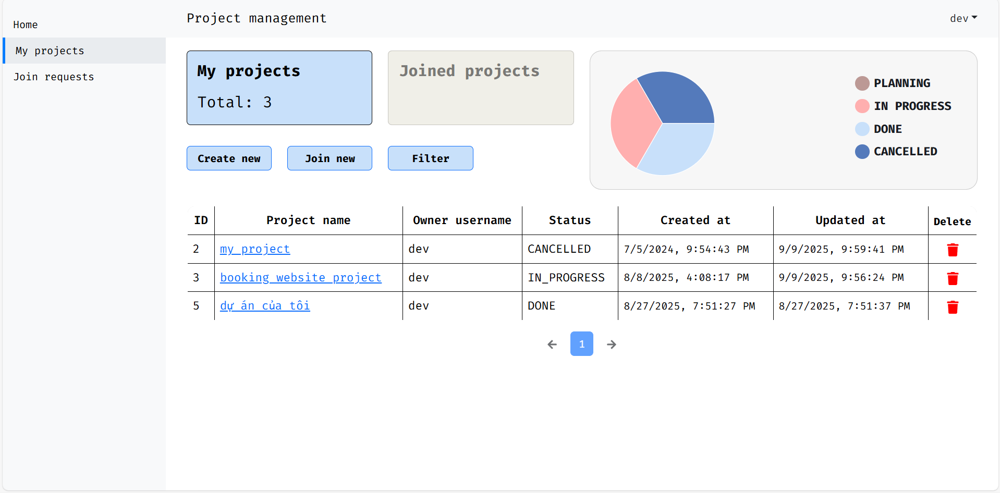
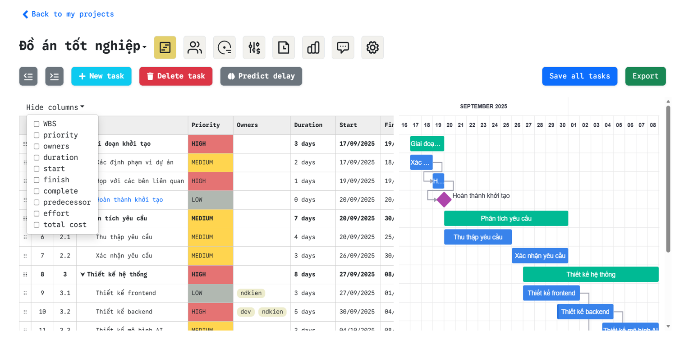
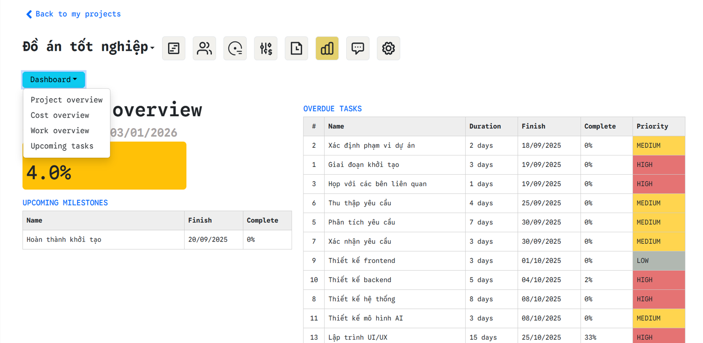

# Project management website
## Overview
This website allow user manage tasks within their own projects and collaborate with other users across the system. The platform also integrates machine learning model to predict task delay based on task context, helping user make informed decisions and proactively manage project progress.
## Features
- Administration
    + Login
    + User management: view, delete, suspend, ban user accounts
    + Currency management
    + View system overview report
    + View user projects
    + Machine learning model management: upload, active, delete models
- General user
    + Login
    + Register
    + View task summary
    + Project management
    + Join request management: send, review join requests (accept/reject)
    + Task management with gantt chart and drag-drop table, can mark project done or cancel project
    + Update task progress (for assigned resource - project member)
    + Export tasks (csv file)
    + Predict task delay
    + Resource (member) management: view, delete resources, add via accepting join request
    + Resource tag management
    + Issue and issue's comment management
    + Extra cost management
    + View project action log
    + View project reports
    + Real-time chat with all members in project
## Tech stack
ReactJS, Spring Boot, Django, MySQL, MongoDB, Redis, WebSocket, JWT, Docker, Rate limiting, Caching, Machine learning
## Environment preparaion
- **JDK** 17+ (check with ``java --version`` and ``javac --version``)
- **NodeJs** 18+ (check with ``node --version``)
- **Python** 3.11.x (check with ``python --version``)
- Already installed **Docker engine** and **Docker Compose**
- Running Docker engine before starting web server
## Setup
### Client-side
Access client folder
```bash
cd client 
```
Initialize your environment variables
```bash
cp .env.example .env
```
Customize your own env file

Install dependencies
```bash
npm install
```
### Server-side
Main server
```bash
cd server
```
Initialize your environment variables
```bash
cp application.properties.example application.properties
```
Customize your own application.properties file

Machine learning server
```bash
cd ml_server
```
Install requirement libraries
```bash
pip install -r requirements.txt
```
Initialize your environment variables
```bash
cp .env.example .env
```
Customize your own env file

Migration (after running Docker compose)
```bash
python manage.py migrate
```
## Quick experience
Start main server
```bash
cd server
./mvnw spring-boot:run
```
Start machine learning server
```bash
cd ml_server
py manage.py runserver
```
Start client
```bash
cd client
npm run dev
```
Accounts for testing
1. **ADMIN:** Username ``admin`` and password ``admin123``
2. **USER:** Username ``devtrung`` and password ``dev``
## Demo
#### Admin dashboard page UI

####  User home page UI

#### My project page UI

#### Project detail UI

#### Report page UI

