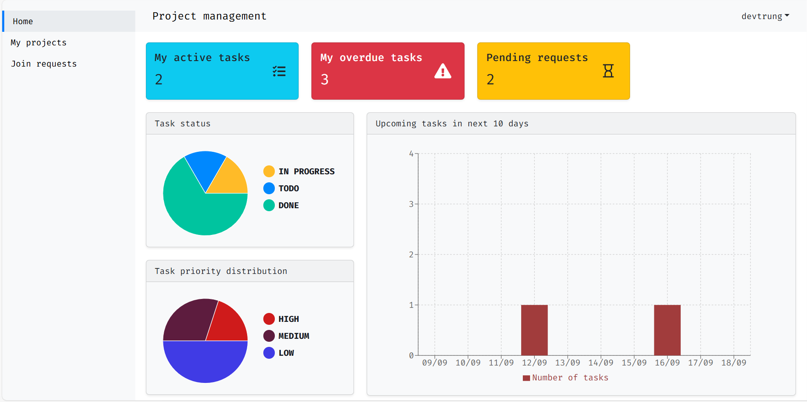
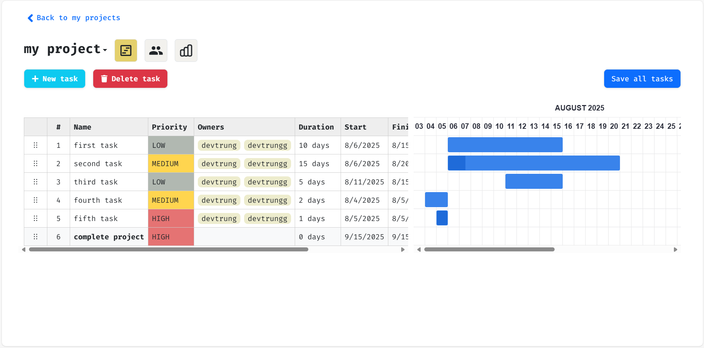
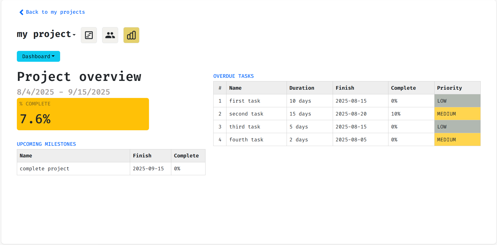

# Project management website

## Environment preparaion
- **JDK** 17+ (check with ``java --version`` and ``javac --version``)
- **NodeJs** 18+ (check with ``node --version``)
- **Python** 3.11.x (check with ``python --version``)
- Already installed **Docker engine** and **Docker Compose**
- Running Docker engine before starting web server
## Setup
### Client-side
Access client folder
```bash
cd client 
```
Initialize your environment variables
```bash
cp .env.example .env
```
Customize your own env file

Install dependencies
```bash
npm install
```
### Server-side
Main server
```bash
cd server
```
Initialize your environment variables
```bash
cp application.properties.example application.properties
```
Customize your own application.properties file

Machine learning server
```bash
cd ml_server
```
Install requirement libraries
```bash
pip install -r requirements.txt
```
Initialize your environment variables
```bash
cp .env.example .env
```
Customize your own env file

Migration (after running Docker compose)
```bash
python manage.py migrate
```
## Quick experience
Start main server
```bash
cd server
./mvnw spring-boot:run
```
Start machine learning server
```bash
cd ml_server
py manage.py runserver
```
Start client
```bash
cd client
npm run dev
```
Accounts for testing
1. **ADMIN:** Username ``admin`` and password ``admin123``
2. **USER:** Username ``devtrung`` and password ``dev``
## Demo
#### Admin dashboard page UI

####  User home page UI

#### My project page UI

#### Project detail UI

#### Report page UI

